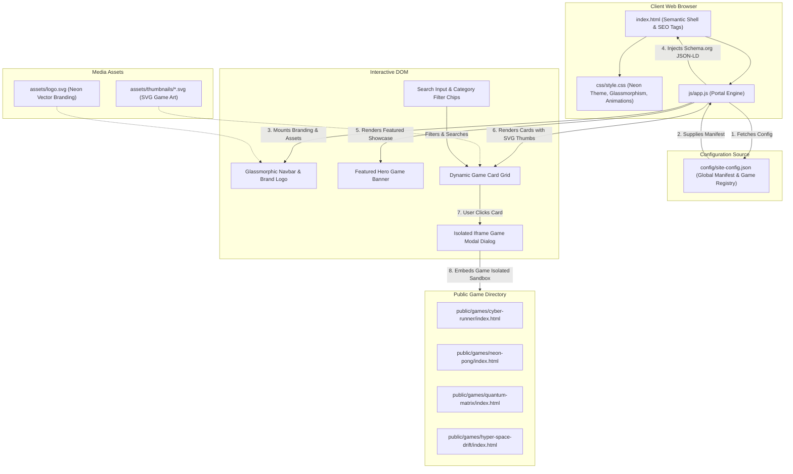

# System Architecture & Technical Roadmap
## "Next Games/Game" — Dynamic HTML5 Web Game Portal

---

## 1. Executive Summary & Vision
"Next Games/Game" is a dynamic, high-performance, SEO-optimized web gaming portal engineered to showcase HTML5 games with zero-friction onboarding. Designed around a futuristic, vibrant neon dark-mode aesthetic with glassmorphic depth, the platform dynamically ingests game configurations from a single centralized manifest (`config/site-config.json`), rendering an interactive game gallery with lightning-fast filtering, real-time search, responsive grid layouts, and an immersive `<iframe>` modal player with fullscreen and sound toggles.

---

## 2. Directory Architecture & Boundary Isolation

Strict isolation guarantees that only production-ready code is delivered in the root, while meta-tooling, test suites, and documentation reside in the developer workspace:

```text
gaming-portal/
├── developer/                        # [META-DIRECTORY] Isolation for tooling & docs
│   ├── prompt.md                     # User prompts & operational instructions
│   ├── rules.md                      # Guardrails, zero-deletion rule, constraints
│   ├── working-prompt.md             # Real-time task tracking & phase status
│   ├── roadmap.md                    # This master architectural blueprint
│   └── test-portal.js                # Node.js automated verification & validation suite
├── config/
│   └── site-config.json              # Single source of truth for portal & game catalog
├── assets/
│   ├── logo.svg                      # Programmatic neon SVG vector logo
│   └── thumbnails/                   # High-res SVG artwork banners for games
│       ├── cyber-runner.svg
│       ├── neon-pong.svg
│       ├── quantum-matrix.svg
│       ├── hyper-space-drift.svg
│       ├── orbital-defense.svg
│       └── chrono-switch.svg
├── public/
│   └── games/                        # Self-contained HTML5 games
│       ├── cyber-runner/             # Neon endless cyber obstacle runner
│       │   ├── index.html
│       │   ├── game.css
│       │   └── game.js
│       ├── neon-pong/                # AI-reactive neon paddle duel
│       │   ├── index.html
│       │   ├── game.css
│       │   └── game.js
│       ├── quantum-matrix/           # Grid-based neon puzzle/defense
│       │   ├── index.html
│       │   ├── game.css
│       │   └── game.js
│       └── hyper-space-drift/        # Vector space combat & drifting
│           ├── index.html
│           ├── game.css
│           └── game.js
├── css/
│   └── style.css                     # Neon visual tokens, glassmorphism, responsive grid, animations
├── js/
│   └── app.js                        # App bootstrapping, config fetch, DOM rendering, modal manager, SEO engine
└── index.html                        # Semantic HTML5 shell, SEO tags, JSON-LD Schema container
```

---

## 3. Data Flow & Component Interaction Pipeline

The diagram below illustrates how client bootstrap, dynamic configuration loading, user interactions, and the iframe game execution isolate and communicate:



---

## 4. Dynamic Configuration (`config/site-config.json`) Specification

The configuration acts as the single source of truth for the portal. Its schema is defined as:

```json
{
  "siteMetadata": {
    "siteName": "Next Games/Game",
    "siteTagline": "The Next Frontier of Web3 & HTML5 Gaming",
    "siteDescription": "Immerse yourself in Next Games/Game - a premier portal for high-octane, instant-play HTML5 games featuring sleek cyberpunk visuals, reactive physics, and zero installation.",
    "siteUrl": "https://next.gamer.free",
    "siteLogo": "assets/logo.svg",
    "themeColor": "#00f0ff",
    "accentColor": "#ff007f",
    "contactEmail": "portal@next.gamer.free",
    "socialLinks": {
      "twitter": "https://twitter.com/nextgamesportal",
      "discord": "https://discord.gg/nextgames",
      "github": "https://github.com/next-games-game"
    }
  },
  "categories": [
    { "id": "all", "label": "All Games", "icon": "🎮" },
    { "id": "action", "label": "Action & Reflex", "icon": "⚡" },
    { "id": "arcade", "label": "Arcade Retro", "icon": "🕹️" },
    { "id": "strategy", "label": "Sci-Fi Strategy", "icon": "🧠" },
    { "id": "space", "label": "Space & Flight", "icon": "🚀" }
  ],
  "games": [
    {
      "id": "cyber-runner",
      "title": "Cyber Runner 2099",
      "slug": "cyber-runner",
      "category": "action",
      "categoryLabel": "Action & Reflex",
      "thumbnail": "assets/thumbnails/cyber-runner.svg",
      "path": "public/games/cyber-runner/index.html",
      "description": "Dash through a high-voltage cyber-city skyline, jumping over photon barriers and sliding under laser sensors at supersonic velocities.",
      "rating": 4.9,
      "plays": "142.8K",
      "badge": "Trending",
      "tags": ["Endless Runner", "Cyberpunk", "Reflex", "Neon"],
      "controls": "Space / Up Arrow to Jump, Down Arrow to Slide, P to Pause",
      "features": ["Procedural Obstacle Generation", "Particle Pulse Effects", "Local High-Score Persistence"],
      "releaseDate": "2026-08-15"
    }
  ]
}
```

---

## 5. Auto-Load & Extensibility Workflow

To add a new game to "Next Games/Game":
1. Place the game folder inside `public/games/<game-id>/` containing an `index.html`.
2. Add a new game object to `config/site-config.json` specifying `title`, `slug`, `category`, `thumbnail`, `path`, and copy.
3. Save the file.
4. On browser reload, `js/app.js` automatically parses the new entry, generates category filters, renders the game card with hover animations, updates the search index, and links the iframe modal with zero code changes in `index.html`.

---

## 6. UI/UX & Visual Styling Engine (`css/style.css`)

### 6.1 Color Matrix & CSS Custom Properties
```css
:root {
  --bg-primary: #070913;
  --bg-secondary: #0c1022;
  --bg-card: rgba(16, 22, 48, 0.7);
  --bg-glass: rgba(12, 16, 34, 0.85);
  
  --neon-cyan: #00f0ff;
  --neon-magenta: #ff007f;
  --neon-violet: #8a2be2;
  --neon-emerald: #00ff88;
  --neon-amber: #ffaa00;

  --text-primary: #f0f4ff;
  --text-secondary: #8e9bb8;
  --text-muted: #566485;

  --border-subtle: rgba(0, 240, 255, 0.15);
  --border-active: rgba(0, 240, 255, 0.6);
  --shadow-neon: 0 0 25px rgba(0, 240, 255, 0.35);
  --shadow-magenta: 0 0 25px rgba(255, 0, 127, 0.35);

  --font-display: 'Orbitron', -apple-system, BlinkMacSystemFont, 'Segoe UI', sans-serif;
  --font-body: 'Rajdhani', -apple-system, BlinkMacSystemFont, 'Segoe UI', sans-serif;
}
```

### 6.2 Motion Design & Keyframes
- **Fade-In & Slide-Up**: Used for initial page loading and game card rendering transitions.
- **Card Hover Mechanics**: Scale transform (`translateY(-8px) scale(1.02)`), rotating border glow gradient, and dynamic cyan/magenta glow shadow casting.
- **Glassmorphism**: Header navbar and modal overlays utilize `backdrop-filter: blur(16px) saturate(180%)` with a subtle semi-transparent border.

### 6.3 Responsive Grid Architecture
- Mobile (`< 640px`): Single column layout with simplified compact cards.
- Tablet (`640px - 1024px`): 2 column grid.
- Laptop (`1024px - 1440px`): 3 column grid.
- Desktop Ultra-wide (`> 1440px`): 4 column grid with expansive featured hero unit.

---

## 7. Interactive Modal Architecture (`js/app.js`)

1. **State Isolation**: When a game card is clicked, the modal initializes an `<iframe>` pointing to the game's `path`. It grants standard iframe permissions (`fullscreen; autoplay; gamepad`).
2. **Performance & Memory Management**: When the modal closes, the `src` attribute is immediately set to `about:blank` and removed from memory to prevent audio leaks or background CPU drain.
3. **Player Controls**:
   - Fullscreen toggle using Fullscreen API on the modal/iframe container.
   - Restart button that reloads the iframe.
   - Close button + `Escape` key listener + backdrop click to dismiss.
   - ARIA modal focus trapping: focus is automatically locked inside the dialog and returned to the trigger button upon closure.

---

## 8. Playable Games Roster in `public/games/`

To guarantee real, fully-functional showcase value without external dependencies:

1. **`cyber-runner`**:
   - Canvas-based 60fps endless runner.
   - Player controls a futuristic cyber-cycle / neon avatar jumping and sliding past laser gates.
   - Sound effects via Web Audio API synth oscillators (no external audio files required!).
   - High score tracker in `localStorage`.

2. **`neon-pong`**:
   - Cyberpunk paddle battle against an adaptive AI.
   - Glowing ball trails, deflection velocity physics, score counters, and particle explosions on impact.
   - Responsive canvas supporting touch and mouse/arrow keys.

3. **`quantum-matrix`**:
   - Neon grid puzzle / memory hacking game.
   - Sequence matching and pattern disruption with cyber terminal aesthetics.
   - Sound synthesis and multi-stage difficulty levels.

4. **`hyper-space-drift`**:
   - Vector Asteroids / Space drift shooter.
   - Inertial ship physics, thruster particle trails, laser blasters, and shattering asteroid fragments.

---

## 9. SEO, AEO & AGO (AI Engine Optimization) Strategy

1. **Semantic HTML5**: Native `<header>`, `<nav>`, `<main>`, `<section>`, `<article>`, `<figure>`, `<footer>`, `<dialog>`.
2. **Dynamic Meta Generator**:
   - Generates document `<title>` based on active filters and site manifest.
   - Updates `<meta name="description">`, `<meta name="keywords">`, `<link rel="canonical">`.
   - Open Graph tags (`og:title`, `og:description`, `og:image`, `og:url`, `og:type`).
   - Twitter Card tags (`summary_large_image`).
3. **Schema.org Structured Data (JSON-LD)**:
   - `WebSite` Schema: With potentialAction for SearchAction queries.
   - `Organization` Schema: Branding "Next Games/Game", logo, and contact info.
   - `CollectionPage` Schema: Enclosing catalog metadata.
   - `VideoGame` Schema: Injected for each game with `name`, `description`, `genre`, `playMode`, `operatingSystem`, `applicationCategory`, and `offers`.
4. **Answer Engine Optimization (AEO)**:
   - Structured FAQ section embedded into semantic HTML and Schema.org `FAQPage` markup answering common player queries: "What is Next Games/Game?", "Are HTML5 games free to play without installation?", "How do I submit my game?".

---

## 10. Automated Testing Protocol (`developer/test-portal.js`)

A dedicated Node.js test script will perform deep validation without requiring external testing frameworks:
1. **Config Validation**:
   - Asserts `siteMetadata.siteName` is strictly `"Next Games/Game"`.
   - Asserts valid array of games with non-empty titles, descriptions, paths, and thumbnails.
2. **File Existence Validation**:
   - Asserts `assets/logo.svg` exists and is valid SVG.
   - Asserts every game thumbnail referenced in `site-config.json` exists on disk.
   - Asserts every game `path` referenced in `site-config.json` exists and contains an `index.html`.
3. **Semantic HTML & CSS Integrity**:
   - Asserts `index.html` contains required semantic landmark tags (`<header>`, `<main>`, `<dialog>`, `<footer>`).
   - Asserts `css/style.css` contains keyframe animations, glassmorphism rules, and responsive media queries.
   - Asserts `js/app.js` contains event listeners, modal control logic, and Schema.org injection.
4. **Exit Codes & Error Reporting**:
   - Returns exit code 0 on 100% pass; exits with detailed stack trace and code 1 on failure.

---

## 11. Implementation Schedule

- **Phase 1 (Complete)**: Architecture, Roadmap, Scaffolding, and Rule Specs.
- **Phase 2 (Current)**:
  - Step 2.1: `config/site-config.json`
  - Step 2.2: `assets/logo.svg` & game thumbnails
  - Step 2.3: `public/games/` four playable HTML5 games
  - Step 2.4: `index.html`
  - Step 2.5: `css/style.css`
  - Step 2.6: `js/app.js`
- **Phase 3 (Testing & Verification)**:
  - Step 3.1: Build `developer/test-portal.js`
  - Step 3.2: Execute test suite and iterate if necessary until full verification.
